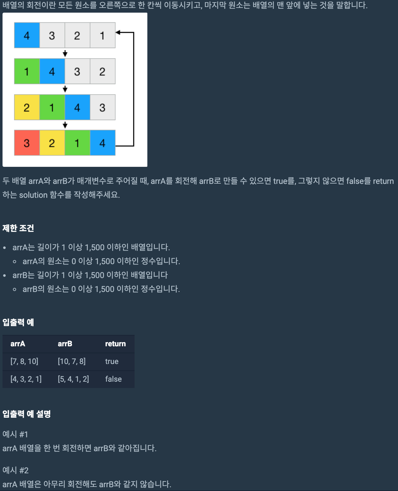
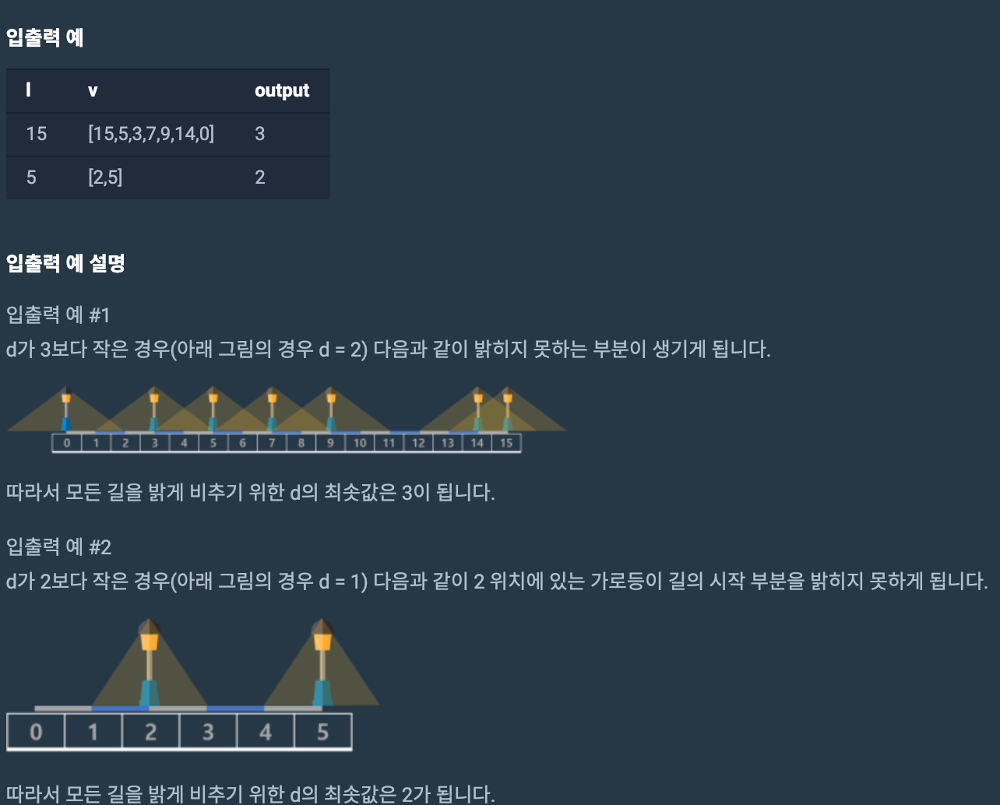
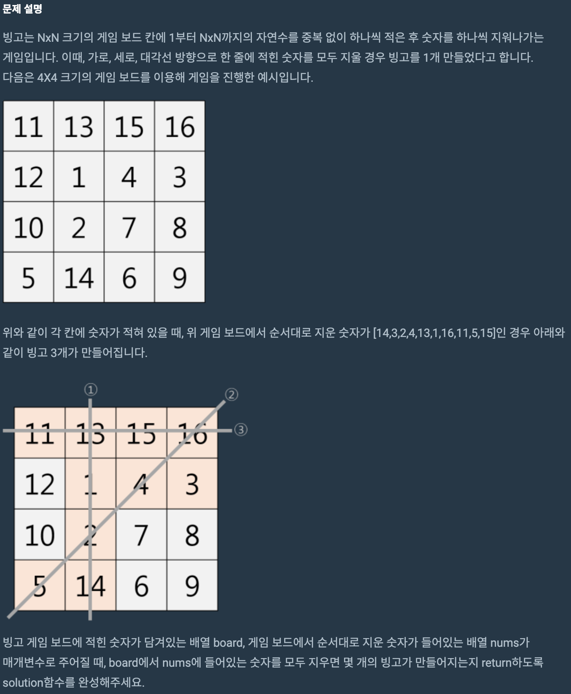
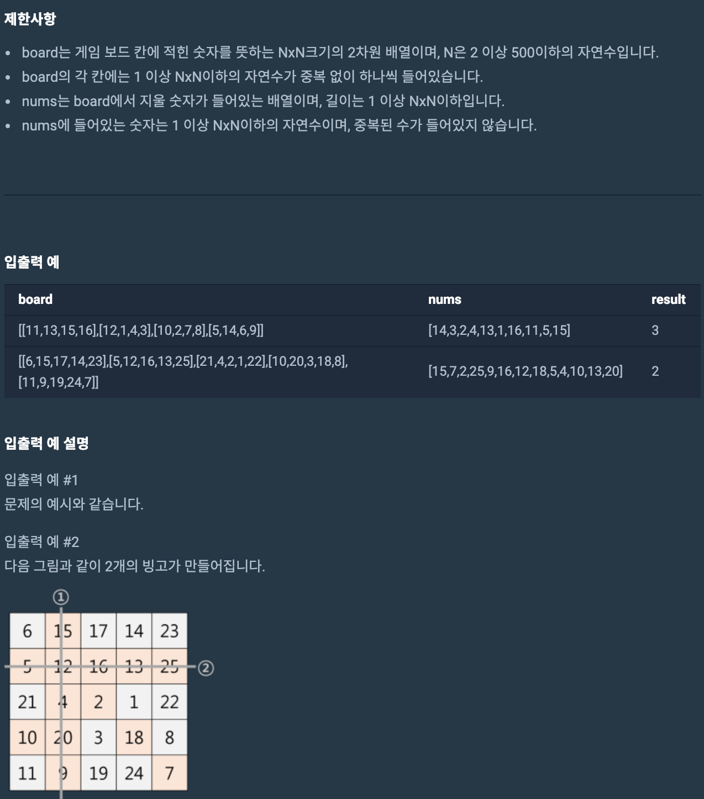

# programers 공채 모의고사 2회

## 1

;

```js
function solution(arrA, arrB) {
  for (let i = 0; i < arrA.length; i++) {
    let item = arrA.pop();
    arrA.unshift(item);
    if (arrA.join("") == arrB.join("")) {
      return true;
    }
  }
  return false;
}
```

정확성 100
효율성 100

## 2

### 문제 설명

서울시에 일직선 모양의 새로운 도로가 생겼습니다. 새로운 도로의 전체 길이는 l이고 도로에는 총 n개의 가로등이 세워졌습니다. 이 도로의 모든 가로등에 전구를 사서 달려고 합니다. 전구를 선택하는 기준은 다음과 같습니다.

전구는 길의 좌측, 우측 방향으로 각각 d 길이만큼 길을 밝힐 수 있고, d는 자연수입니다.
모든 가로등에는 같은 종류(d 값이 같은)의 전구를 달아야 합니다.
안전을 위하여 도로위에 어두운 부분이 있어서는 안 됩니다.
이때, d 값이 충분히 크다면 전체 도로를 밝게 비출 수 있지만, d 값이 작아진다면 도로 위에 빛이 닿지 않는 부분이 생길 수도 있습니다. 따라서, 도로 위에 어두운 부분이 생기지 않도록 하는 d 값 중 최솟값을 구하려고 합니다. 전체 도로의 길이 l, 가로등이 세워져 있는 위치가 들어있는 배열 v가 매개변수로 주어질 때, 위의 모든 조건을 만족하는 d 의 최솟값을 return 하도록 solution 함수를 완성해주세요.

### 제한사항

l은 1 이상 1,000,000,000 이하의 자연수입니다.
v에는 가로등의 위치정보가 들어있습니다.
가로등의 위치는 0 이상 l 이하의 정수이며, 같은 위치에 2개 이상의 가로등이 있는 경우는 주어지지 않습니다.
가로등의 개수는 1이상 1,000 이하의 자연수입니다.



```js
function solution(l, v) {
  v.sort((x, y) => x - y);
  let result = 1;
  while (result < 500) {
    let newArr = [];
    for (let i = 0; i < v.length; i++) {
      if (i === 0) {
        newArr.push(v[i] - 0);
      } else {
        newArr.push(v[i] - v[i - 1]);
      }
    }
    if (newArr.filter(item => result * 2 < item).length === 0) {
      return result;
    } else {
      result++;
    }
  }
}
```

정확성 8/14

효율성 0

합계 40

## 3





```js
function solution(board, nums) {
  let bingo = 0;
  let diagonalNum = 0;
  let reverseNum = 0;
  for (let i = 0; i < board.length; i++) {
    // 가로 체크
    if (
      board[i].filter(item => {
        return nums.includes(item);
      }).length === board.length
    ) {
      bingo++;
    }
    // 세로 체크
    let heightNum = 0;
    for (let j = 0; j < board.length; j++) {
      if (!nums.includes(board[j][i])) {
        break;
      } else {
        heightNum++;
      }
    }
    if (heightNum === board.length) {
      bingo++;
    }
    // 대각선 체크
    if (nums.includes(board[i][i])) {
      diagonalNum++;
    }
    if (diagonalNum === board.length) {
      bingo++;
    }
    // 역 대각선 체크
    if (nums.includes(board[i][board.length - 1 - i])) {
      reverseNum++;
    }
    if (reverseNum === board.length) {
      bingo++;
    }
  }
  return bingo;
}
```

정확성 100

효율성 0

합계 70 점

## 총합계 210점

### 느낀점

효율성 부분에서 절약을 해야하는데 계속 덜미를 잡힌다.

for문 이중으로 들어가면 거의 효율성에서 탈락하는듯..

근데 배열같은 경우는 2중포문 안쓰면 어떻게 하지..

좀더 공부를 해보자.

알고리즘은 집중력이 미친듯이 상승해서 2시간 반이 순삭이었다. 이런부분이 재미있고 흥미를 당긴다.

말그대로 연습이니 조금 더 공부해보도록 하자

> 테스팅.. 깃
